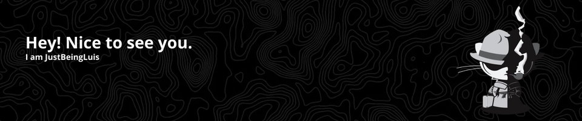

#  Welcome to my GitHub!

## 🚀 Hello there!

I'm Luis Mario Toscano Palomino, a Computer Science student in my final year at Universidad Industrial de Santander (UIS) and a Full Stack Developer. I specialize in building scalable web applications and conducting applied research in Computer Vision, Biomedicine, and Intelligent Systems.

---

### 👨‍💻 About Me

- 🎓 Currently in my 4th year of Systems Engineering.
- 🔬 Lead and co-author in applied research projects using **YOLOv5**, **CNNs**, and **signal processing**.
- 💻 Full Stack developer experienced with **Django**, **PostgreSQL**, and **React**.
- 📊 Skilled in **data science**, **machine learning**, and **computer vision**.
- 📌 Focused on blending strong engineering principles with real-life impact.

---

### 📌 Projects & Highlights

- **🔍 Drone Detection using Modulo Images (YOLOv5 + HDR reconstruction)**  
  Principal investigator of a high-intensity illumination drone detection system using modulo-ADC sensing and computer vision.

- **👁️ Myopic Vision Restoration using Deep Learning**  
  Co-author of a project combining gradient-regularized CNNs with PSNR enhancement techniques for simulated myopia correction.

- **📚 BiblioMatch UIS (Web Platform)**  
  Full Stack platform for academic book management, user reviews, and admin control panel — built using Django and PostgreSQL.

- **🍷 DeepWine (Data Science Project)**  
  Red wine quality classification with supervised learning models, trained on physicochemical data.

---

### 🧪 Technologies & Tools

**Frontend & UI:**

**Backend and data bases:**

**IA / Ciencia de datos:**

---

### 🤝 Let’s Connect!

I'm open to collaboration on:

- 🔍 Research projects (AI, CV, biomedical applications)  
- 🧑‍💻 Development of impactful software solutions  
- 🎯 Internship or research assistant opportunities

📫 Reach out via [LinkedIn](https://www.linkedin.com/in/luistoscanop/)  
🌐 Portfolio: [Coming soon...]  
📍 Based in Bucaramanga, Colombia

---

### 💡 Skills Summary

**Soft Skills:**  
Effective communication · Critical thinking · Adaptability · Teamwork · Fast learning

**Languages:**  
- Spanish: Native  
- English: Advanced (B2 – certified by UIS)

---
